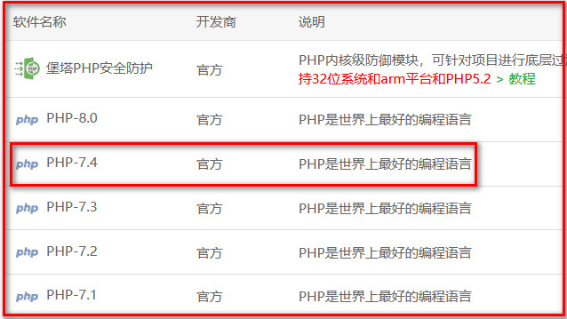
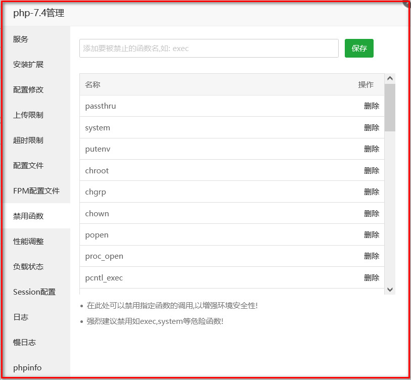
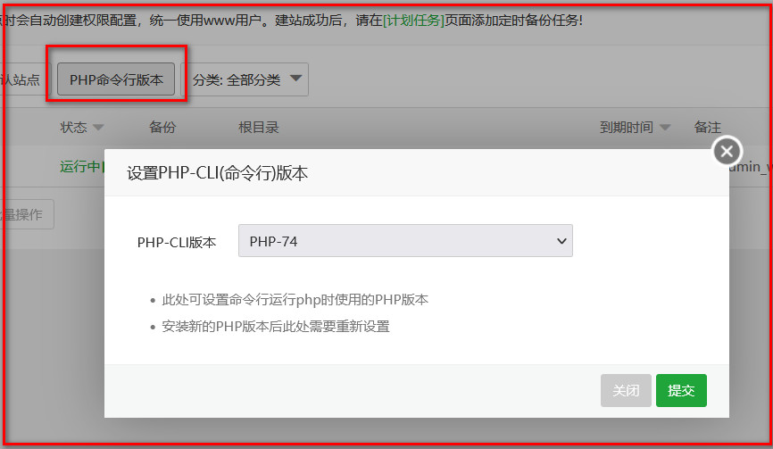

# traceroute 
1、使用PHP手动构造报文实现的traceroute程序

2、为早期整理的项目 只实现了ICMP方式 至于UDP和TCP方式未实现

4、目前支持CentOS 8、CentOS7系统 PHP版本要求为 PHP 7 >= 7.3.0, PHP 8

3、由于引入了阿里云IP地址地理位置接口 所以探测过程中的IP地址会自动解析地理位置

4、演示地址：https://traceroute.web.witersen.com

5、以下参数可调整 已写好配置 

是否解析节点的地理位置 默认不解析
解析地址对应的主机名 默认不解析
初始ttl的值 默认为1
等待超时时间 默认为1ms
初始的最大ttl值 默认为30
发包的睡眠时间即间隔时间 默认为0
每个点发送探测包的数量 默认为10


## 一 、系统部署 - CentOS8.2裸机

### （1）安装 PHP 7.4 及依赖

```
yum install -y zip unzip wget                 #压缩与解压缩和下载工具
yum module list php                           #查看可用的PHP模块
yum module -y enable php:7.4                  #启用PHP7.4，默认为启用PHP7.2
yum install -y php                            #安装PHP7.4
yum install -y php-process                    #pentl扩展和posix扩展
yum install -y php-json                       #json相关函数

```

### （2）安装 Web 服务器
```
yum install -y httpd                #安装Apache
systemctl start httpd               #开启Apache
systemctl enable httpd              #将Apache加入开机自启动
systemctl restart php-fpm           #重启php-fpm

```

### （3）下载并解压部署程序
- 在控制台 执行以下命令
```
cd /var/www/html
wget xxx
unzip xxx.zip

```

### （4）启动后台程序

- 进入程序代码的server目录，在命令行下以root用户身份执行以下命令

```
cd server
php svnadmind.php start

```

## 二 、系统部署 - 基于CentOS的宝塔面板

### （1）安装 PHP 7.4



### （2）解禁 PHP7.4 禁用的函数

- 解禁PHP7.4中 pcntl_signal、pcntl_fork、pcntl_wait、shell_exec 四个被宝塔面板默认禁用的函数


### （4）将PHP的命令行版本更换至安装的PHP7.4



### （5）下载并解压部署程序
- 在网站目录切换到宝塔控制台 执行以下命令 
```
wget xxx
unzip xxx.zip

```

### （6）启动后台程序

- 进入程序代码的server目录，在宝塔控制台下以root用户身份执行以下命令

```
cd server
php svnadmind.php start

```